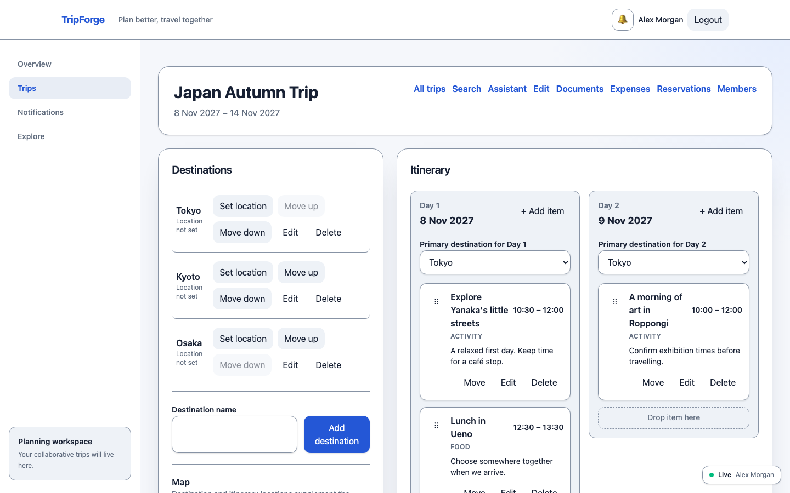
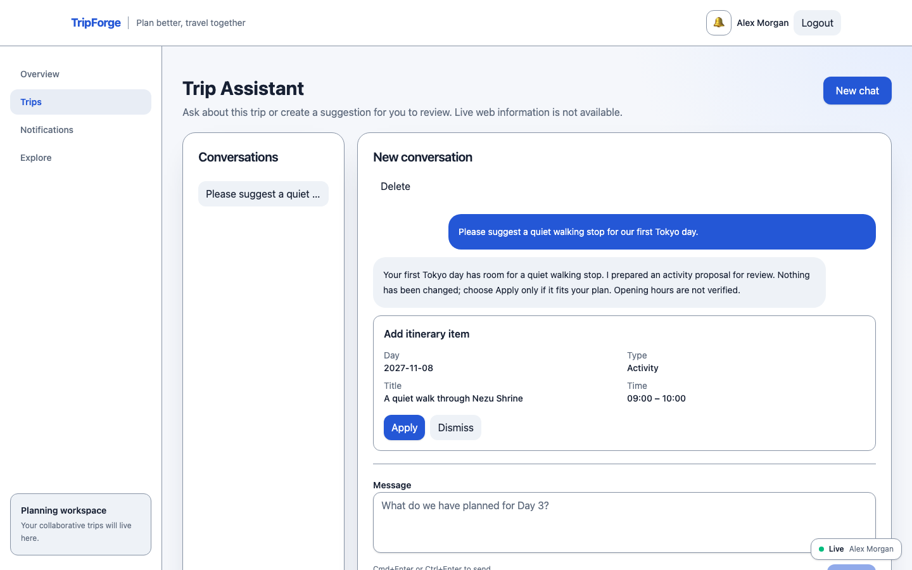
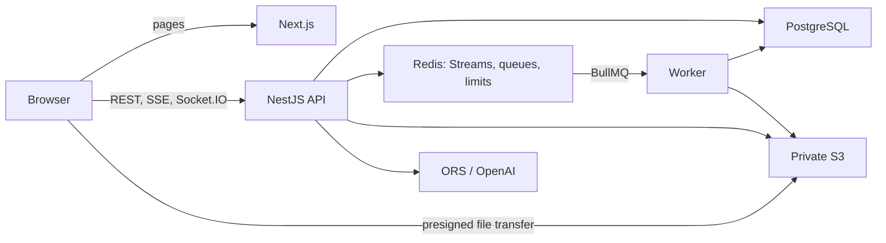

# TripForge

## Collaborative travel planning platform

TripForge brings shared itineraries, reservations, expenses, private documents,
realtime updates, search and a grounded AI assistant into one travel workspace.
It demonstrates frontend-focused software engineering with end-to-end system
ownership: from accessible React interactions to transactional data, recovery
testing and an AWS deployment architecture.

**Status: v1.0.0 release candidate / portfolio project; not yet published.**
The complete mandatory hosted `main` Gate passed for the current security-fixed
candidate. Stage 32 dependency closure accepts one time-bounded HIGH advisory
in development-only ESLint tooling after proving it absent from deployable artifacts;
the machine-checkable audit remains blocking for every unexpected HIGH/CRITICAL
(see the [current verification report](docs/stage33-release-verification.md)). Terraform is locally
validated; real AWS
deployment and cloud recovery qualification remain pending. No live demo is
currently published.

[Engineering case study](docs/portfolio-case-study.md) ·
[Claim → evidence index](docs/portfolio-evidence.md) ·
[Interview walkthrough](docs/portfolio-interview-guide.md) ·
[v1.0.0 notes](docs/releases/v1.0.0.md) ·
[Changelog](CHANGELOG.md) ·
[MIT License](LICENSE)

## Screenshots

Actual application UI with fictional Japan travel data. The assistant image uses
a deterministic test-only provider, not a live OpenAI response.




[Desktop gallery and mobile view](docs/portfolio-case-study.md#application-gallery)

## Key capabilities

- Collaborative Trips with owner/editor/viewer access, destinations and dated Days.
- Itinerary planning with pointer/keyboard reorder and an explicit non-drag Move flow.
- Optional maps/place search and persisted route snapshots; reservations with transport details.
- Exact shared expenses, per-currency balances and settlement suggestions; private direct uploads.
- Realtime freshness, durable notifications and permission-scoped Trip search.
- A private grounded assistant that proposes itinerary changes for human approval.

## Engineering highlights

- Opaque HttpOnly sessions with hash-at-rest, expiry, revocation and current-DB RBAC.
- Explicit React server/client boundaries; TanStack Query owns remote state, not form input.
- PostgreSQL commits remain truth; cross-node Socket.IO carries small invalidations.
- PostgreSQL outbox → BullMQ worker makes object cleanup recoverable after Redis loss.
- Direct private S3 uploads and PostgreSQL FTS/trigram search avoid unnecessary API/data services.
- AI tools have server-injected scope; only normal domain code can apply an approved proposal.
- Accessibility, bundle budgets, security and failure drills are enforced by repeatable tests.
- SHA-pinned CI and immutable OCI promotion map the existing system to ECS/Terraform.

## Architecture



Next renders the shell and routes; interactive browser leaves call the API.
Socket.IO is a freshness channel, not a second mutation API.
[Detailed architecture and decisions](docs/portfolio-case-study.md#architecture)
and [AWS mapping](docs/aws-deployment.md).

## Verified engineering evidence

| Evidence | Verified scope |
| --- | --- |
| 12 critical browser scenarios | Chromium, production-built local stack, real PG/Redis/S3, no retry masking |
| 13 recovery drills | Local dependency failure/recovery, logical restore, two-node sockets and active shutdown |
| 30-minute soak + 100 sockets | 20 VUs; 181.779 mean RPS; p95 20.483ms / p99 90.305ms; 0% unexpected HTTP errors |
| Bundle improvement | Historical Stage 25 non-map initial JS 669,804 → 630,115 B; shared JS 632,886 → 506,200 B |
| AWS architecture | Terraform fmt/validate/mock tests and IaC scan; not actual cloud deployment |

Soak context: Apple M1/8 CPU/16 GiB, Docker VM 8 CPU/4,109,803,520 B,
20 users/Trips, 420 Days, 3,360 items, 480 reservations, 960 expenses/shares,
320 document metadata rows and 400 notifications. Workload: 80% reads/20%
bounded writes, 100ms think time, no external provider or file-byte load.
These are local observations, not a production user limit or achieved SLO.
[Full qualification](docs/stage31-qualification.md) · [Capacity](docs/capacity.md).

## Technology overview

| Responsibility | Main choices |
| --- | --- |
| Frontend | Next.js 16, React 19, TypeScript, TanStack Query, React Hook Form, Tailwind, MapLibre |
| API / data | NestJS 11, PostgreSQL 18, Drizzle, opaque sessions and typed contracts |
| Realtime / background | Socket.IO Redis Streams, Redis, BullMQ, transactional outbox |
| Testing / operations | Vitest, PostgreSQL/Testcontainers, Playwright 1.63.0, axe, k6 2.3.0, Pino / OpenTelemetry |
| Delivery / AI | Docker/OCI, GitHub Actions, Terraform/ECS/RDS/ElastiCache/S3; OpenAI Responses with human approval |

## Local development

Requirements: Node.js 24, pnpm 12.3.4 and Docker. Optional provider credentials
are server/build configuration, not a prerequisite for core planning.

For the reproducible portfolio stack, with no paid keys or LocalStack account:

```bash
corepack enable
pnpm install --frozen-lockfile
pnpm exec playwright install chromium
pnpm readiness:serve
```

The launcher creates new disposable PostgreSQL/Redis/S3 services, builds in a
temporary source copy and applies migrations twice. Open
<http://127.0.0.1:3310>; API health/readiness use port 4410. Register a fictional
account; Ctrl+C stops only owned services. Ports must be free. AI/provider
behavior here is deterministic test-only behavior, not live-provider validation.

For faster native development, environment templates, Compose/token requirements
and all commands, see [Local development](docs/local-development.md) and
[Docker runtime](docs/docker.md).

```bash
pnpm docs:check
pnpm test:e2e
PORTFOLIO_BASE_URL=http://127.0.0.1:3310 pnpm portfolio:screenshots
```

Do not run multiple disposable launchers concurrently. Screenshots are intentional
local artifacts, never regenerated by CI.

## Documentation

Start with the [case study](docs/portfolio-case-study.md) and
[evidence index](docs/portfolio-evidence.md), then follow a boundary:

- [Authentication](docs/authentication.md), [database](docs/database.md), [server state](docs/server-state.md).
- [Realtime](docs/realtime.md), [background work](docs/background-jobs.md), [search](docs/search.md), [AI](docs/ai-assistant.md).
- [Security](docs/security-hardening.md), [accessibility](docs/accessibility.md), [performance](docs/performance.md), [observability](docs/observability.md).
- [CI/CD](docs/ci-cd.md), [AWS](docs/aws-deployment.md), [readiness](docs/production-readiness.md), [release checklist](docs/release-checklist.md).

## Project status and next step

Stage 33 has passed the mandatory hosted `main` qualification. The owner selected
the MIT License. GHCR publication remains pending final delivery-configuration
qualification/retry; repository rules, immutable-release settings and private
vulnerability reporting still require verification. Actual AWS deploy/PITR/
failover/rollback/IAM QA remains pending, as do live OpenAI/ORS/MapTiler;
VoiceOver/Safari and native zoom; image-risk review and longer client heap profiling.
Known unfixed base-OS findings are not a proven exploitable TripForge bug, but
require release-owner review. Small socket-client heap drift is recorded, not hidden.
See [publication checklist](docs/portfolio-publication-checklist.md).
