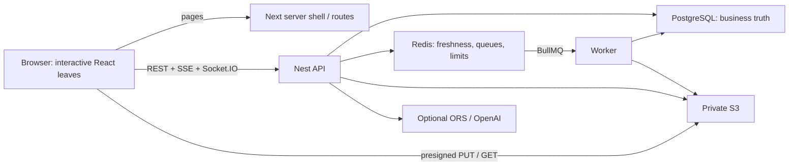
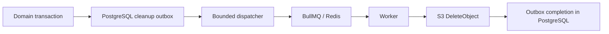
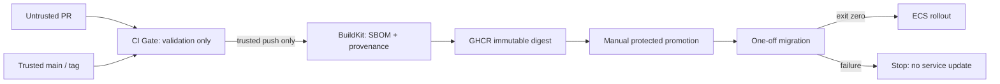
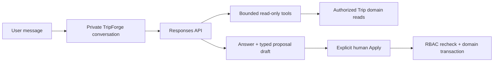
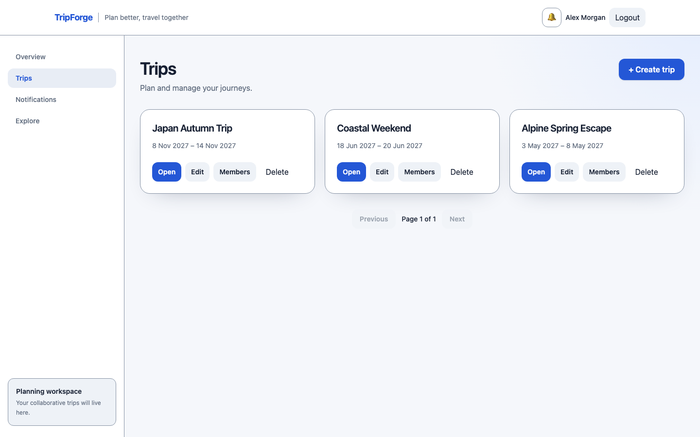
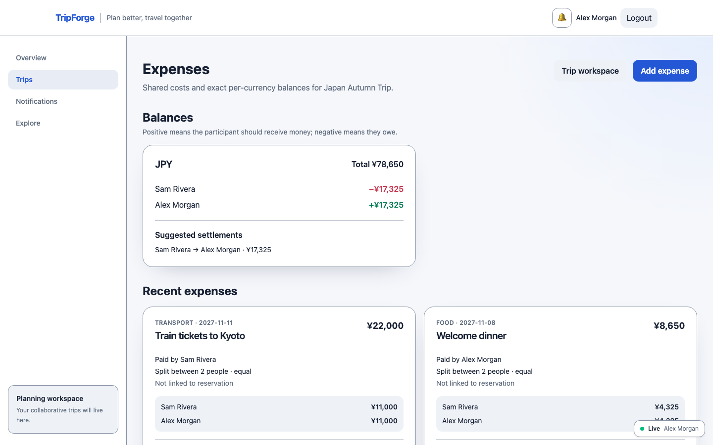
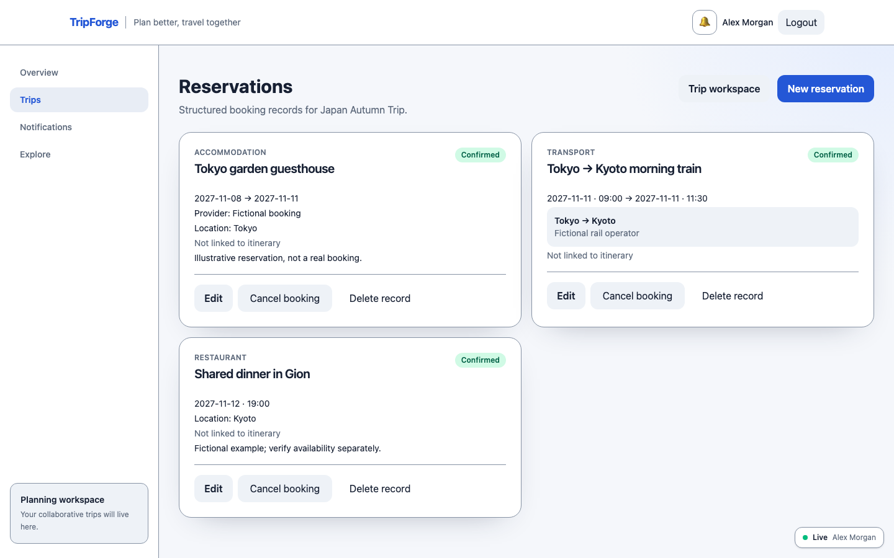
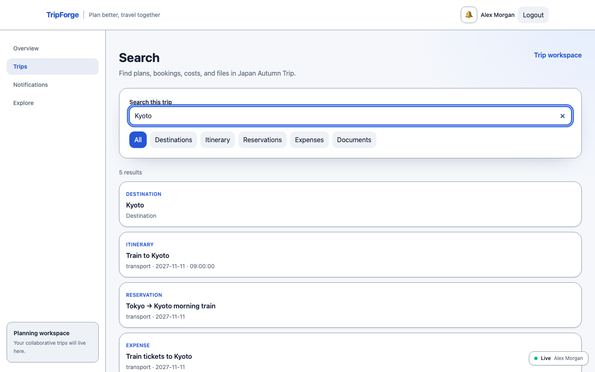
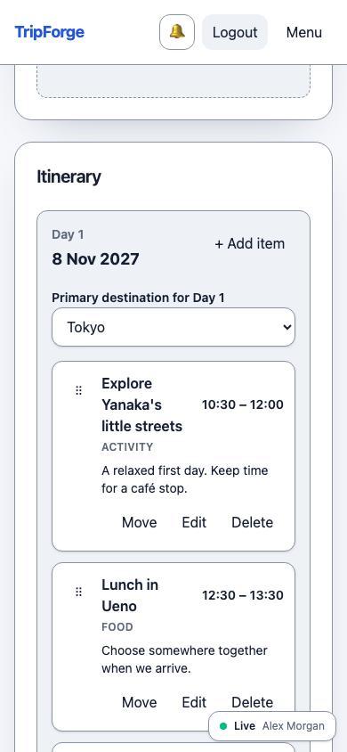

# TripForge: engineering a collaborative travel workspace

[Product overview](../README.md) · [Evidence index](./portfolio-evidence.md) ·
[Interview guide](./portfolio-interview-guide.md)

## Executive summary

TripForge is a collaborative travel planner: people share a Trip, arrange dated
itineraries, keep transport and booking details, split expenses, store private
documents and find information across the workspace. A private assistant reads
authorized Trip data and drafts itinerary changes for explicit human approval.

I used this portfolio project to explore frontend-focused software engineering
with end-to-end ownership. A polished interaction is only useful if permission
changes, failed requests and reconnects preserve the right state. That led from
React forms and drag-and-drop into transaction design, private capabilities,
durable cleanup, observability and failure qualification—not just more screens.

The result is an unreleased release candidate, not a service with claimed
production traffic. Local qualification includes 12 Chromium E2E scenarios,
13 recovery drills and a 30-minute HTTP/socket soak. AWS infrastructure and
immutable delivery are implemented/configured; actual AWS and live-provider
qualification remain pending. Every quantitative claim below links to retained
repository evidence rather than a generated marketing benchmark.

## Problem and scope

Travel information is fragmented: a schedule in one place, tickets elsewhere,
costs in a spreadsheet and changes in messages. TripForge puts those resources
behind one permission-scoped workspace without pretending to book travel,
verify live opening hours or aggregate incomparable currencies.

The scope deliberately reaches beyond UI: typed API contracts, PostgreSQL
modeling, sessions/RBAC, realtime freshness, workers, security, accessibility,
performance, telemetry, CI/CD, AWS and constrained AI. The frontend remains the
center of the story: responsive layouts, forms, maps, streaming interaction and
recovery from changing remote state. This demonstrates project ownership, not
employment experience, a professional title or a production operating history.

## Development approach and ownership

Implementation was **AI-assisted**. The staged workflow made requirements,
architecture boundaries, non-goals and acceptance criteria explicit; coding
agents accelerated implementation, diagnostics and test execution. The work was
checked against deterministic tests, real-database integration, browser behavior
and documented gates. I do not claim that every line was manually typed or that
agent-generated tests replace independent human/security review.

The ownership to discuss is scope, trade-off selection, authorization boundaries,
review criteria, test design and failure analysis. For example, a green unit suite
did not close browser debt: later Chromium runs found contrast/layout/focus/CSP
issues, and Stage 31 diagnosed an ignored Redis publication rejection rather than
raising retry counts to hide it. Failed qualification attempts remain failures.

## Architecture

Next renders routes and the shell; client leaves call Nest directly. There is no
extra Next BFF carrying file bytes or a second write API over WebSockets. The
worker shares the API artifact but runs a separate entrypoint. Optional providers
and telemetry can fail without invalidating PostgreSQL readiness.

### Flagship decisions at a glance

| Problem | Decision and why | Alternative considered | Trade-off | Evidence/result |
| --- | --- | --- | --- | --- |
| Logout and permission changes must take effect | Opaque DB sessions and current membership checks | JWT claims as durable permission state | DB lookup/statefulness | Auth/RBAC/revoke E2E and session integration |
| Replicas and reconnects must converge | Small invalidations followed by REST refetch | Full authoritative state over sockets | Extra reads; best-effort event gaps | Two-node / 100-client drill and reconnect proof |
| Metadata commit must not lose S3 deletion intent | PostgreSQL outbox with at-least-once worker | Redis-only enqueue after commit | Eventual cleanup/reconciliation | 120 rows recover after Redis FLUSHDB |
| Model suggestions must not gain write authority | Typed proposals plus explicit Apply in normal domain transaction | Autonomous agent mutations | Additional confirmation and stale conflicts | AI privacy/RBAC/idempotent-Apply tests |

## Frontend: boundaries and recoverable interaction

Server Components are the default shell/route boundary, with client islands for
interactive behavior. I did not turn the application into an all-client SPA to
manage forms and a few rich widgets. TanStack Query owns remote entities,
freshness and domain-specific invalidation; React Hook Form owns editable values;
URL/local React state owns navigation, confirmations, drag state and map camera.
Background refetch must not replace a user's unsaved input.

The itinerary has optimistic reorder, complete rollback snapshots and deferred
itinerary refetch during an active drag. Other resources stay live. Search and
place autocomplete debounce input and pass AbortSignal; errors/loading states
are part of the interaction, not console-only diagnostics. MapLibre is a lazy,
supplementary view: lists/forms remain the canonical interface. The assistant's
SSE deltas are transient UI state; completion reconciles persisted conversation
state, and Stop confirms cancellation rather than merely hiding text.

Sources: [server-state model](./server-state.md),
[realtime bridge](../apps/web/components/realtime/authenticated-realtime-bridge.tsx),
[itinerary card](../apps/web/components/trips/itinerary-item-card.tsx),
[assistant UI](../apps/web/components/trips/assistant-screen.tsx).

## Authentication, authorization and data correctness

**Problem:** revocation and current Trip permissions cannot depend on stale token
claims. **Decision:** a random opaque token lives in an HttpOnly cookie; PostgreSQL
stores its SHA-256 hash and absolute expiry, never the raw token. Logout removes
the session and disconnects its room across API nodes. **Why:** immediate server
revocation and one HTTP/socket identity path. **Alternative:** JWT. **Trade-off:**
stateful DB lookups rather than independent stateless validation. **Evidence:**
[session service](../apps/api/src/auth/session/session.service.ts),
[auth design](./authentication.md), [browser suite](../e2e/qualification.spec.ts).

Authentication is not authorization: every resource uses current Trip membership,
and unreadable resources return anti-enumerating 404 responses. PostgreSQL keys,
constraints, transactions and locks complement service checks. A dedicated DML
role handles API/worker traffic; migrations use a separate owner/admin path.

Expenses are a useful correctness example. Values are integer minor units with
currency exponents; equal-share remainders are deterministic, custom shares must
sum exactly, balances/settlements stay per currency. There is no invented FX total.
Chromium verified 12,345 USD minor units split 6,172/6,173 and a custom 10,000-minor-unit
settlement against authoritative API data. [Expense design](./expenses.md).

## Realtime: freshness, not another source of truth

**Problem:** multi-node clients can miss or reorder events. **Decision:** send
Trip IDs and closed resource names, not complete authoritative objects. **Why:**
PostgreSQL stays truth and reconnect repair becomes fresh auth → join → refetch.
**Alternative:** replicate application state over sockets. **Trade-off:** extra
reads and best-effort freshness during outages. **Evidence:** 100 authenticated
clients across two APIs all received one invalidation in 17 ms locally; this is one
observation, not a production latency percentile. [Realtime](./realtime.md) and
[publisher](../apps/api/src/realtime/trip-realtime.publisher.ts).

Redis also supports BullMQ and shared security limits. It is not a business data
store. Its outage leaves ordinary authenticated DB reads and `/ready` available,
but protected limiter actions fail closed; “optional for readiness” does not mean
“optional for every user operation.”

## Background processing and the notification contrast

**Problem:** PG commit and Redis enqueue are an unsafe dual write. **Decision:**
metadata deletion and cleanup intent commit atomically; a bounded dispatcher
rebuilds jobs from incomplete PG rows. **Why:** Redis/worker loss cannot erase
required work. **Alternative:** Redis-only enqueue. **Trade-off:** eventual object
deletion, retries and at-least-once delivery—not exactly once. Completed-row state
and idempotent S3 deletion make repeat delivery safe. Previously issued signed
URLs can still work until expiry; metadata deletion is not instant capability
revocation. [Outbox](./background-jobs.md),
[dispatcher](../apps/api/src/background-jobs/cleanup-outbox-dispatcher.service.ts),
[processor](../apps/api/src/background-jobs/storage-cleanup.processor.ts).

Notifications illustrate why not every event needs another queue. They are
already PostgreSQL business data and are written in the originating transaction.
Socket.IO only invalidates the inbox afterward; lost freshness cannot lose the
notification. [Notification consistency](./notifications.md).

## Private documents and search

Direct presigned PUT avoids proxying up to 25 MiB through Nest. The API grants a
short-lived capability after RBAC, records `pending` metadata, then HEAD-verifies
size/type before publication as `ready`. The bucket is private; authorized
downloads are short-lived and generated on demand. The trade-off is a two-phase
lifecycle and retryable finalization, rather than a single API request carrying
bytes. MIME allowlisting is not malware scanning. [Documents](./documents.md).

Search uses stored generated FTS vectors and `pg_trgm` indexes across existing
Trip tables. A parameterized, globally bounded query preserves RBAC and excludes
private codes/file contents. OpenSearch would add replication/operation costs
without a demonstrated need. In the historical Stage 25 warm fixture, selective
itinerary search returned 37 rows with a 0.815 ms median: two warmups/seven samples,
PG 18.6, ARM/macOS, about 3,800 itinerary rows, no disk reads. PG chose a sequential
scan at that scope; I did not force an index just to improve a plan screenshot.
This is a local SQL observation, not search HTTP latency or a scale limit.
[Search](./search.md), [plans](./performance.md),
[repository](../apps/api/src/trips/trip-search.repository.ts).

## Accessibility as interaction design

WCAG 2.2 AA is a target, not certification. Keyboard DnD alone is not the complete
Dragging Movements alternative, so every editable item also has a click/touch
Move flow using the same authoritative reorder path. Focus restoration, resource-
specific labels, native landmarks, polite status regions and visible form errors
make async behavior understandable, not merely axe-compliant.

Chromium exercised real pointer drag, keyboard reorder, non-drag cross-Day Move,
mobile navigation, combobox/composer keys and 320/375/768 px reflow. Six screens had
zero tested axe violations and no app CSP violations. VoiceOver/Safari, actual
200%/400% zoom, text spacing and forced colors still need manual qualification.
[Accessibility](./accessibility.md), [manual checklist](./accessibility-manual-qa.md).

## Performance: measure, then decide what not to optimize

Historical Stage 25 Webpack production observations (Next 16.3.4, Node 24.18.0,
pnpm 12.3.4, ARM/macOS) separated total bytes from initial-route cost:

| Metric | Before | After | Decision |
| --- | ---: | ---: | --- |
| Maximum non-map initial JS |669804 B|630115 B|Lazy authenticated realtime bridge |
| Shared initial JS |632886 B|506200 B|Keep guests out of socket/validation graph |
| Non-map initial CSS |112282 B|29125 B|Move 83,157 B MapLibre CSS into existing lazy map boundary |

Total JS barely changed: the improvement was when bytes were needed, not a claim
that the map vanished. Ten semantic bundle budgets guard compiler drift without
depending on hashed filenames. I deferred blanket memoization, virtualization,
extra indexes and clustering because measurements did not justify them.
LCP/INP/CLS are targets, not retained field/RUM results. [Performance](./performance.md).

## Security: layered boundaries, explicit costs

The security story combines opaque sessions, dummy Argon2 checks for nonexistent
users, shared Redis throttling, current-membership IDOR/BOLA checks, strict
CORS/Origin, JSON/custom-header/Fetch-Metadata layers and private signed storage.
Nonce CSP intentionally imposes dynamic rendering cost in exchange for stronger
script policy. Zod's eval probe was later made jitless rather than weakening CSP
with unsafe-eval. None of this warrants “100% secure.”
[Threat/control review](./security-hardening.md),
[browser mutation guard](../apps/api/src/auth/browser/browser-mutation.guard.ts).

## Observability: from symptoms to causal evidence

The diagnostic path is X-Request-ID → safe structured JSON record → traceId →
OTel/Jaeger request trace → PG/provider span, alongside Prometheus pool/backlog/
latency signals. Bounded labels avoid user/Trip IDs, prompts and signed URLs.
Collector failure is not a business dependency. There is no browser RUM claim.

A retained Stage 27 ARM microbenchmark measured 200 sequential production-build
`/health` requests with unreachable local exporters: mean 1.749 ms OTel-off and
2.138 ms on, +0.389 ms (+22.202% against a tiny baseline). It does not establish
representative workload overhead or hosted latency. [Observability](./observability.md),
[measurement context](./performance.md#observability-overhead).

## CI/CD, supply chain and AWS mapping

Actions are full-SHA pinned. PRs validate without publication or AWS keys;
successful trusted pushes may publish immutable OCI artifacts. Manual promotion
checks the candidate revision/digests and requires migration success before
rolling services. Local tests execute the actual deploy shell with fake AWS:
migration exit 42 causes zero service updates. This is not an AWS rollback drill.
[CI/CD](./ci-cd.md), [workflow](../.github/workflows/ci.yml).

AWS maps the existing architecture rather than rewriting it: containers→ECS
Fargate, PostgreSQL→RDS, Redis→ElastiCache, object abstraction→S3. Private services
sit behind ALB; secrets/IAM/task roles and migration boundaries are explicit.
ECS avoids Kubernetes operation cost without a demonstrated need; standard RDS
avoids assuming Aurora benefits before measurement. Terraform fmt/validate/mock
tests/IaC scan passed locally. Real plan/apply, effective IAM/TLS, PITR, failover
and rollback are **Pending AWS qualification**; no cloud resources/live URL are
claimed. [AWS design](./aws-deployment.md), [Terraform](../infra/terraform/production).

## AI: proposals without mutation authority

**The model can propose a mutation. It never receives authority to perform the
mutation directly.**

TripForge owns chat history. Every Responses request uses `store:false`; bounded
history and minimal authorized tool output are sent explicitly. This disables
response application-state storage, not all provider retention/processing; see
[official OpenAI data controls](https://developers.openai.com/api/docs/guides/your-data).
I do not claim Zero Data Retention or a live-provider pass from a config flag.

Trip/user scope is injected by the server, absent from model tool schemas. Notes
are untrusted tool data, not instructions. Typed create/update/move proposals
stay inert until Apply rechecks current permission, validates references and runs
normal domain code in a locked transaction; stale proposals conflict and repeated
Apply is idempotent. There is no web search, autonomous booking, destructive AI
action or document-content ingestion. Streaming/Stop/viewer/privacy tests use a
deterministic provider boundary, not real OpenAI.
[AI design](./ai-assistant.md), [provider request](../apps/api/src/ai/openai-client.service.ts),
[orchestrator](../apps/api/src/ai/ai-turns.service.ts),
[approval](../apps/api/src/ai/ai-proposals.service.ts).

## Production-oriented qualification, not a production claim

| Evidence | Status | Source |
| --- | --- | --- |
|12 critical E2E scenarios; real cookie/RBAC/DnD/files/SSE |Verified in Chromium |[Browser suite](../e2e/qualification.spec.ts) |
|Real PG authorization/search/transactions + full integration gate |Verified with PostgreSQL/Testcontainers |[Testing](./testing-strategy.md) |
|Six screens axe 0; keyboard/reflow/CSP |Verified in Chromium |[Stage 31](./stage31-qualification.md) |
|Security/AI/privacy regressions and secret checks; dated dependency audit |Verified locally; one exact expiring lint-only exception |[Security](./security-hardening.md), [current report](./stage32-verification.md) |
|Ten bundle budgets; historical before/after |Verified locally |[Performance](./performance.md) |
|Smoke/load/stress/30m soak + 100 sockets |Verified locally |[Capacity](./capacity.md) |
|13 dependency/recovery/restore/drain drills |Verified locally |[Drill implementation](../scripts/readiness/qualify.mjs) |
|Terraform architecture/mock tests; immutable-delivery workflows |Configured for AWS |[AWS](./aws-deployment.md), [CI/CD](./ci-cd.md) |
|Live AWS/provider/manual AT results |Pending AWS qualification / Pending live-provider qualification / Manual QA pending |[Release checklist](./release-checklist.md) |

The accepted local soak used 20 VUs for 1,800.068 s with 100 authenticated sockets:
327,214 requests, 181.779 mean RPS, p95 20.483 ms / p99 90.305 ms, 0% unexpected errors,
100% checks. Environment: Apple M1 / 8 CPU / 16 GiB, Node 24.18.0; Docker VM 8 CPU /
4,109,803,520 B; PG 18.6 / Redis 8.10.1 / S3 emulator 4.14.0. Dataset: 20 users/Trips,
420 Days, 3,360 items, 480 reservations, 960 expenses/shares, 320 metadata documents,
400 notifications. Mix 80% reads/20% bounded writes, 100 ms think time, sessions once;
no Argon2 per iteration, provider calls or file-byte load. Stress used four 2-minute
linear ramps to 25/50/75/100 VUs; the threshold breakpoint was not reached, and 100
was not held for 2 minutes. This is not a production user maximum or achieved 99.9% SLO.

Three instructive expected→observed failures:

- PG unavailable → `/health` 200, `/ready` 503, controlled core 500; process survived
  and recovered readiness/reads without an API reset.
- Redis unavailable/lost → ordinary reads/ready 200, protected login 503 fail-closed;
  PG outbox survived FLUSHDB. Redis is transport, not cleanup truth.
- Worker down → backlog age rose; 120 durable rows later drained in 31.211 s
  (~3.845 rows/s including dispatcher wait), failed 0. This is recovery throughput,
  not raw S3 deletion capacity.

Logical dump/restore verified 20 table fingerprints and restored DML-role API
session/search, not AWS PITR/RPO/RTO. 100 sockets across two APIs converged in one
17 ms observation; separate 30-minute single-node resource scope kept 100 clients/listeners
through 179 samples and 163,550 invalidations. Pool returned to connections/waiters 0
through normal idle eviction in 29.537 s before shutdown. Earlier failed/interrupted
attempts were excluded, not relabelled green. [Canonical Stage 31 report](./stage31-qualification.md).

## Trade-offs and rejected/deferred alternatives

| Decision | Chosen | Rejected / deferred | Trade-off |
| --- | --- | --- | --- |
|Authentication |Opaque DB sessions |JWT authorization claims |Lookup/statefulness for current revocation |
|Search |PG FTS + trigram |OpenSearch |Bounded scope/ranking; fewer services |
|Realtime |Invalidation + REST |Authoritative state over sockets |Extra reads; easy gap repair |
|Cleanup |PG outbox + BullMQ |Redis-only job creation |At-least-once/eventual deletion |
|Files |Direct signed S3 transfer |API byte proxy |Two-phase finalize/temporary capabilities |
|Cloud runtime |ECS Fargate |Kubernetes |Less operation cost; AWS coupling |
|Database |RDS PostgreSQL |Aurora |No unmeasured scaling/cost assumption |
|AI |Human-reviewed proposals |Autonomous mutation agent |Confirmation/stale conflicts preserve authority |
|Optimization |Profile-driven boundaries |Blanket memoization/virtualization/indexes |Some future work stays pending until evidence |

Not adding a distributed system was often the deliberate engineering decision,
not a missing checklist item.

## Remaining limitations and future profiling

- Stage 32 retains `braces` 3.0.3, HIGH
  [GHSA-vfj7-8cjw-p6xm](https://github.com/advisories/GHSA-vfj7-8cjw-p6xm),
  updated October 2, 2026, with no patched version listed. The reported path is
  the shared ESLint configuration → Next lint plugin → fast-glob → micromatch.
  Final web/API/migrate images and browser chunks do not contain it, and no runtime
  or user-input path invokes it. An exact machine-validated non-production exception
  expires after 2026-11-01; every unrelated HIGH/CRITICAL remains blocking. This is
  risk acceptance, not a claim that the advisory was patched.
- AWS effective IAM/TLS/WSS, deployed role rotation, RDS connection headroom,
  PITR/RPO/RTO, ElastiCache failover and ECS rollback are not verified in cloud.
- Mandatory hosted `main` Gate passed; GHCR retry, repository protections and a
  public live demo are not yet claimed.
- OpenAI/ORS/MapTiler live QA is separate from deterministic test fixtures.
- VoiceOver/Safari, native 200%/400% zoom, text spacing and forced colors remain
  manual QA; XHR/Blob repeated-upload profiling and field Web Vitals/RUM are absent.
- Current final image scans report 48 HIGH + 1 CRITICAL unfixed Debian package
  findings per image, with no remaining fixable HIGH/CRITICAL; no runtime npm
  HIGH/CRITICAL is present. These are not proof of exploitability,
  or a clean-image claim. Vendor/reachability/mitigation review and a named
  release-owner exception or release block are required.
- Socket-client/harness heap median rose 12.422 → 13.765 MiB (+1.344) over 30 minutes while
  listeners stayed 100 and RSS declined. That observation alone cannot identify
  retained objects or prove a leak. Longer runs and heap-snapshot retention-path
  analysis should distinguish harness sampling, allocator/JIT behavior and
  genuinely retained application state; no diagnosis is invented here.

[Publication decisions](./portfolio-publication-checklist.md) record the
owner-approved MIT License. A real private security-reporting channel and hosted
repository settings remain pending; no employment/title, deployment or
availability badge is fabricated.

## What I learned

Correctness boundaries mattered more than adding frameworks: one durable truth
and explicit authority made failures easier to reason about. Realtime worked
better as freshness than a replica of business state. Accessibility improved
product interaction through the normal Move path. Performance work often meant
moving a boundary or declining an optimization, not rewriting a component.

Cloud deployment should preserve a sound architecture, not restart it. AI needs
stronger authorization separation, not privileged tools. Observability replaces
guesswork with causal evidence, but evidence must retain its scope. A passing
laptop drill is a useful result precisely because it is not sold as a production
guarantee.

## Application gallery

All images are actual Chromium captures: 1440×900 desktop, 390×844 mobile, fictional
Japan trip/accounts/reservations. No keys, session values, real emails, AWS IDs or
personal files are shown. Map network calls are blocked; no live map tiles or
live-provider response are implied. The assistant's proposal is created through
the existing test-only provider boundary, with real application persistence/RBAC.
Screenshots illustrate UI, not performance/availability proof.

Regenerate intentionally with
`PORTFOLIO_BASE_URL=http://127.0.0.1:3310 pnpm portfolio:screenshots`.
The script starts its own disposable stack and refuses a different origin.
